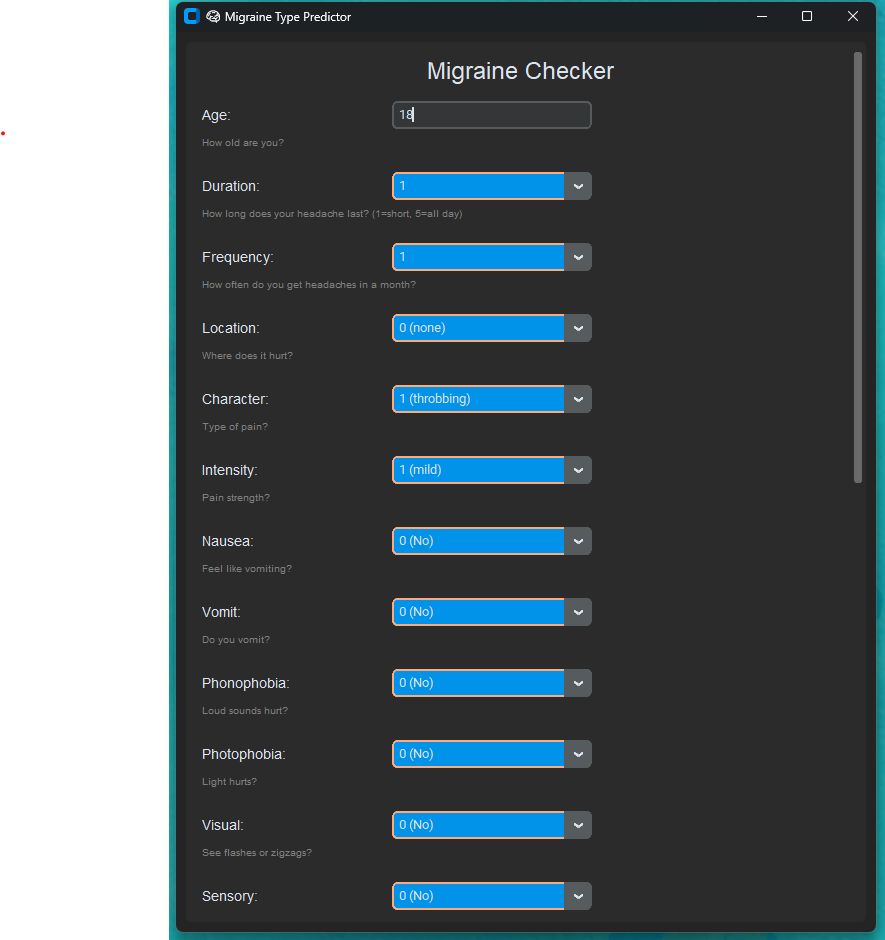

# 🧠 Migraine Type Prediction Desktop App

A smart and user-friendly desktop application that helps patients understand their migraine type based on symptoms. Built with 💻 `CustomTkinter`, trained using machine learning, and designed to provide comfort and clarity to users.

---

## 🌟 Features

- 🔍 Predicts migraine type using 23 symptom-based questions
- 💡 Clear explanations of each migraine diagnosis
- 🎨 Clean, dark-mode themed interface with modern scrollable layout
- 😊 Calming and cheerful result popup for better user experience
- 🧠 Supports types like:
  - Migraine with aura
  - Migraine without aura
  - Basilar-type migraine
  - Hemiplegic migraines
  - Typical aura (with or without migraine)
  - ...and more!

---

## 📸 Screenshots

| Input Form | Prediction Result |
|------------|-------------------|
|  |  |

---

## ⚙️ How It Works

1. Users enter their age and select from multiple-choice symptom descriptions.
2. The app processes this input and uses a trained ML model (`migraine_model.pkl`) to predict the migraine type.
3. A calming result window displays the result and its meaning.

---

## 🧰 Tech Stack

- **Frontend**: [CustomTkinter](https://github.com/TomSchimansky/CustomTkinter)
- **Backend**: Python + scikit-learn (`joblib`)
- **Model**: Trained with symptom-based migraine data
- **Others**: Pillow (image support), NumPy

---

## 🚀 Getting Started

### 🔧 Prerequisites

- Python 3.7+
- Install dependencies:
```bash
pip install customtkinter pillow numpy scikit-learn
